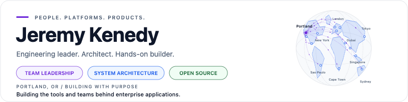
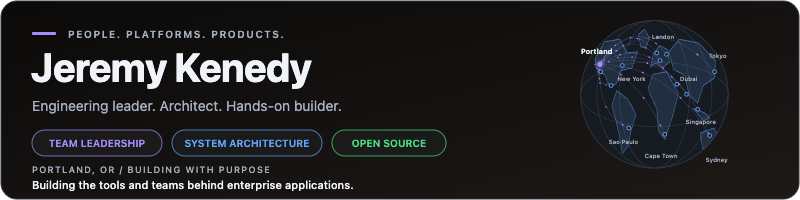

# Profile maintenance

The profile uses Markdown and repository-hosted SVGs. Artwork has light and dark variants and does not depend on a third-party stats-image service.

## Edit the profile

- Edit personal copy, links, and the toolbox in `README.md`.
- Edit selection rules, known derivative exclusions, recent flagships, and concise project copy in `data/showcase.json`.
- Collection lives in `scripts/portfolio.py`; artwork and Markdown rendering live in `scripts/update_profile.py`.
- Keep the paired METRICS, PUBLICATIONS, SHOWCASE, CONTRIBUTIONS, and SUPPORT markers. Their contents are generated.
- Do not add a resume, personal contact details, employer names, or employment metrics.

Regenerate artwork from the checked-in snapshot without network access:

```sh
python3 scripts/update_profile.py --from-cache
python3 -m unittest discover -s tests -v
```

Copy overrides are applied during collection. When changing them, refresh the data before rendering. The renderer uses only the Python standard library. CI uses Python 3.12.

## Refresh public evidence

The Profile metrics workflow runs daily at 13:23 UTC and supports manual runs. It uses the repository's built-in `GITHUB_TOKEN`; no personal token or additional secret is required. The refresh job only writes on this repository's default branch.

To refresh locally, set `GITHUB_TOKEN` or `GH_TOKEN` and run:

```sh
python3 scripts/update_profile.py
```

Credentials are sent only to `api.github.com`. All endpoints require HTTPS and redirects are rejected. All collection and rendering must succeed before existing output is replaced. Failed requests preserve published assets. Obsolete generated project SVGs are removed after a successful render. README image filenames carry a content hash so GitHub image caches cannot keep serving an earlier banner or stale metrics after the asset changes. The renderer keeps readable base SVGs plus content-addressed copies, and removes obsolete versioned copies. Query parameters are insufficient because GitHub drops them when redirecting relative image URLs.

### Authored showcase

The collector paginates owned public, non-fork repositories and excludes archived, empty, unlicensed, and explicitly excluded projects. GitHub's fork flag is not enough: the configuration also records known detached forks and maintained derivatives. Keep those provenance exclusions current when auditing new projects. The Homebrew monitor and its tap are deliberately excluded from the cards at the owner's request.

A project with no meaningful activity in five years is omitted unless it has at least 100 stars. Funding and sponsorship commit subjects are ignored when choosing the activity date from the latest 30 default-branch commits. Projects with at least 10 stars appear first, ordered by descending star count. Below that threshold, the existing ordering is preserved: recent flagships are promoted only while active within 90 days, followed by meaningful activity and then stars. New eligible repositories appear automatically on the next refresh.

Cards use public source evidence:

- GitHub GraphQL supplies stars, languages, licenses, funding links, and default-branch commit totals.
- Public GitHub release pagination supplies release counts and the most recently published release, including prereleases and excluding drafts.
- GitHub's public repository `/_sidebar` JSON supplies the same Used by and contributor counts shown on repository pages. This is an undocumented UI endpoint; a response or schema failure must stop the refresh rather than publish invented counts. Contributors may include bot accounts.
- Packagist counts use verified package-to-repository mappings. GitHub release download counts sum public release assets where the README advertises that download badge. npm badges use npm's public downloads API and display their reporting interval; an old `dt` badge is treated as the available 18-month window, never as lifetime downloads.
- Made with Laravel appears only when that project's README links to its listing.

Repository commit totals are not personal authored totals. The separate public authored commit count comes from GitHub's public commit search and covers indexed default-branch history. It is not a complete career or private-work count. Language bytes are not lines of code, so no personal LOC total is estimated.

### Distribution totals

Packagist downloads include repeated installs and maintained forks; they do not measure people. Stars, forks, and language shares use owned public repositories GitHub marks as non-forks, including archived repositories. Language shares count primary languages, not code volume or proficiency.

Published project totals combine Packagist repository metadata, npm packages maintained by `developernator` or `jeremykenedy`, formula and cask files in owned Homebrew taps, and public GitHub releases. Prereleases count; drafts and bare tags do not. Source URL normalization deduplicates projects across channels. A tap does not count as an extra software project. Formula files are read as text, never executed.

The GitHub Packages registry is checked separately. If packages appear there, collection stops until their source repositories are mapped. Unexpected or missing package source metadata also stops collection. Add any new npm publisher account to `NPM_PUBLISHERS` when needed. Published distributions can include maintained derivatives; they are intentionally separate from the stricter authored showcase.

### Contributions

Search explicitly uses `is:public` and excludes the account's own repositories. The ledger deduplicates pull requests and distinguishes merged, open, and closed submissions. Private work is excluded even when the local token could access it. Configured exclusions omit non-contribution repositories such as interview exercises. Curated highlights described as merged must link to verified merges.

## Review before publishing

Run the unit suite, regenerate from cache, and confirm the generated files match the snapshot. Check the actual GitHub renderer at phone, tablet, and desktop widths in automatic and manually selected light/dark themes. Check image loading, text clipping, wrapping, links, and banner motion. Reduced-motion picture sources select dedicated static banner SVGs, because embedded SVG media queries do not consistently inherit the browser preference. The banner copy stays still in either version.

Each card uses a native left-aligned table to keep its repository link and separate Star/Sponsor links together. Width-only picture sources account for GitHub's changing sidebar widths: two columns below 768px, three from 768px, and four from 1280px. SVG variants keep text legible at narrow widths. The minimum tested viewport is 320px. GitHub strips custom layout CSS and image `sizes`; do not introduce them as layout dependencies. Theme fragments on paired links prevent the native theme helper from rewriting compound theme/width queries. Keep width and theme selection separate.

The Star link opens the repository's stargazers page with GitHub's native Star control. A README cannot submit a star action itself. The project Sponsor link opens that repository's funding dialog with `?sponsor=1`. General support badges link directly to the account's funding destinations, all at the same height.

If GitHub changes its profile widths, theme behavior, or sidebar response, recheck the actual page. Scheduled workflows can be disabled on inactive public repositories; check Actions if updates stop.

Merging into the default branch of `jeremykenedy/jeremykenedy` publishes the README to the profile.

## Banner previews

The circular globe illustrates connections from Portland to 13 major cities. It is a visual motif, not a claim about deployment locations. The leadership line sits below the location in both responsive layouts. Refresh these browser captures whenever the banner changes.

### Mobile

<table>
<tr><td></td></tr>
<tr><td></td></tr>
</table>

### Desktop

<table>
<tr><td></td><td></td></tr>
</table>
