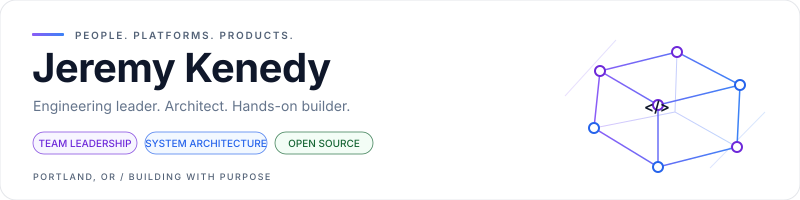
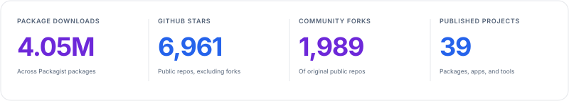
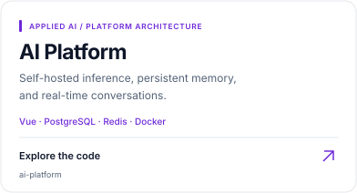
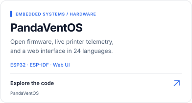
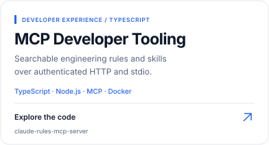
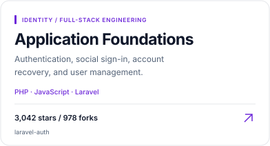
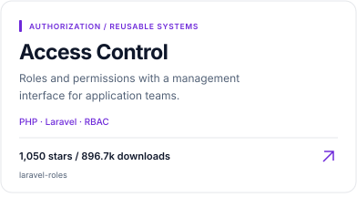
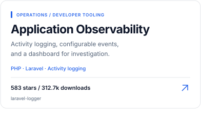
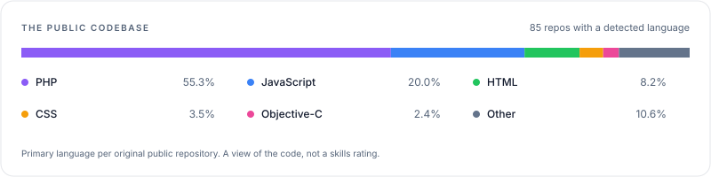

  <picture>
    <source media="(prefers-color-scheme: dark) and (max-width: 600px)" srcset="art/banner-mobile-dark.svg">
    <source media="(max-width: 600px)" srcset="art/banner-mobile-light.svg">
    <source media="(prefers-color-scheme: dark)" srcset="art/banner-dark.svg">
    <source media="(prefers-color-scheme: light)" srcset="art/banner-light.svg">
    
  </picture>

I build useful software and help people do their best work.

  <a href="https://packagist.org/packages/jeremykenedy/">
    <picture>
      <source media="(prefers-color-scheme: dark)" srcset="art/downloads-dark.svg">
      
    </picture>
  </a>
  <a href="https://github.com/jeremykenedy?tab=repositories&amp;type=source&amp;sort=stargazers">
    <picture>
      <source media="(prefers-color-scheme: dark)" srcset="art/stars-dark.svg">
      
    </picture>
  </a>

  <a href="https://jeremykenedy.com/">Website</a> &nbsp; / &nbsp;
  <a href="https://www.linkedin.com/in/jeremykenedy/">LinkedIn</a> &nbsp; / &nbsp;
  <a href="https://github.com/sponsors/jeremykenedy">Support my open source work</a>

  <strong>Contents</strong> &nbsp; <a href="#a-little-about-me">About</a> · <a href="#built-to-be-used">Stats</a> · <a href="#a-few-things-ive-built">Selected work</a> · <a href="#my-toolbox">Toolbox</a> · <a href="#say-hello">Say hello</a>

## A little about me

**14+ years building software. 9 years leading engineering teams. Still writing code.**

I'm an engineering leader and software engineer in Portland, Oregon. I like taking ideas from a rough sketch to something people can actually use, and helping teams find their rhythm along the way.

My work spans web and mobile apps, SaaS platforms, APIs, cloud infrastructure, AI integrations, and the occasional piece of hardware. I care about clear architecture, dependable systems, good developer experience, and treating people well.

Outside the day job, I build in public, maintain open source projects, and follow whatever makes me curious.

## Built to be used

  <picture>
    <source media="(prefers-color-scheme: dark) and (max-width: 600px)" srcset="art/impact-mobile-dark.svg">
    <source media="(max-width: 600px)" srcset="art/impact-mobile-light.svg">
    <source media="(prefers-color-scheme: dark)" srcset="art/impact-dark.svg">
    <source media="(prefers-color-scheme: light)" srcset="art/impact-light.svg">
    
  </picture>

<!-- METRICS:START -->
Updated 2026-09-23 UTC · 4,037,813 Packagist downloads · 6,959 stars · 1,990 forks · 95 original public repositories.
<!-- METRICS:END -->

Where the numbers come from

Downloads are lifetime downloads across every package in the [jeremykenedy Packagist namespace](https://packagist.org/packages/jeremykenedy/), including maintained forks. They represent downloads, not unique users. Stars and forks are summed across my public GitHub repositories that are not themselves forks, including archived projects. Published packages counts Packagist packages only.

The language chart counts each original public repository once, using its primary language as reported by GitHub. Repositories without a detected language are excluded. It describes my public code, not my full professional experience or proficiency.

[Snapshot and exact counts](data/metrics.json) · [Daily refresh](https://github.com/jeremykenedy/jeremykenedy/actions/workflows/profile-metrics.yml)

## A few things I've built

A mix of platforms, developer tools, hardware, and packages that other developers build on. Pick a project to explore the code.

  <a href="https://github.com/jeremykenedy/ai-platform"><picture><source media="(prefers-color-scheme: dark)" srcset="art/project-ai-platform-dark.svg"></picture></a>
  <a href="https://github.com/jeremykenedy/PandaVentOS"><picture><source media="(prefers-color-scheme: dark)" srcset="art/project-PandaVentOS-dark.svg"></picture></a>

  <a href="https://github.com/jeremykenedy/claude-rules-mcp-server"><picture><source media="(prefers-color-scheme: dark)" srcset="art/project-claude-rules-mcp-server-dark.svg"></picture></a>
  <a href="https://github.com/jeremykenedy/laravel-auth"><picture><source media="(prefers-color-scheme: dark)" srcset="art/project-laravel-auth-dark.svg"></picture></a>

  <a href="https://github.com/jeremykenedy/laravel-roles"><picture><source media="(prefers-color-scheme: dark)" srcset="art/project-laravel-roles-dark.svg"></picture></a>
  <a href="https://github.com/jeremykenedy/laravel-logger"><picture><source media="(prefers-color-scheme: dark)" srcset="art/project-laravel-logger-dark.svg"></picture></a>

More to explore: [Vue SPA starter](https://github.com/jeremykenedy/laravel-spa) · [UI components](https://github.com/jeremykenedy/laravel-ui-kit) · [User management](https://github.com/jeremykenedy/laravel-users) · [All repositories](https://github.com/jeremykenedy?tab=repositories&amp;type=source)

## My toolbox

I choose tools around the problem. These are some of the ones I work with:

| Area | Tools and interests |
| :--- | :--- |
| Languages | TypeScript, JavaScript, PHP, SQL |
| Web and mobile | React, React Native / Expo, Vue, Nuxt, Node.js, Laravel |
| Data and APIs | PostgreSQL, MySQL, MongoDB, Redis, REST, GraphQL, WebSockets |
| Infrastructure | AWS, Docker, Linux, Nginx, CI/CD, GitHub Actions |
| Systems | Multi-tenant SaaS, event-driven architecture, authentication, observability |
| Exploring | Local AI, MCP, vector search, embedded systems |

  <picture>
    <source media="(prefers-color-scheme: dark) and (max-width: 600px)" srcset="art/languages-mobile-dark.svg">
    <source media="(max-width: 600px)" srcset="art/languages-mobile-light.svg">
    <source media="(prefers-color-scheme: dark)" srcset="art/languages-dark.svg">
    <source media="(prefers-color-scheme: light)" srcset="art/languages-light.svg">
    
  </picture>

## Say hello

I'm always up for talking about interesting engineering problems, thoughtful teams, and useful things we could build. Open to engineering leadership opportunities where I can help people grow and stay close to the work.

[Get in touch](https://jeremykenedy.com/#contact) · [Connect on LinkedIn](https://www.linkedin.com/in/jeremykenedy/) · [Browse my work](https://github.com/jeremykenedy?tab=repositories&amp;type=source)
